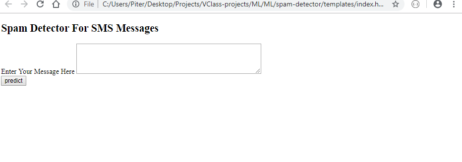
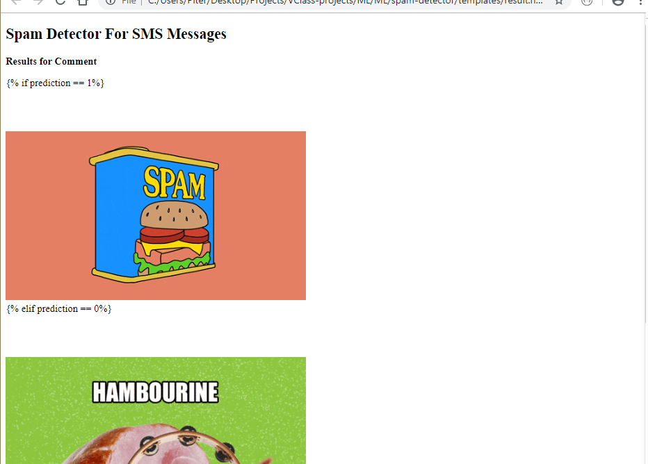

# App--SpanDetector-

## Background

Web-app that uses Machine Learning to Predict if SMS message is ether Span or Hambourine.

## Goals

* Train and Test the given data with a chosen Algorithm 
* Create a Pikle file with the ML model that will be used
* Grab User input in the front-end page
* Create a back-end with Flask
* Create a Front-end page with Bootstrap
* Run the inoputed String in the model
* Return Ressult in Front-end page

## Run Locally

Run this command git clone https://github.com/meuwebsite/App--SpanDetector/

Make sure you have installed in your computer all libraries used above

Double check if you are in the right directory in you terminal ...that often cause errors

Terminal Should be addressed at folder: flask_app

Run the command in your terminal: python app.py 

Copy the output link and paste in your Browser

You are now in the dev environment and you can play around
